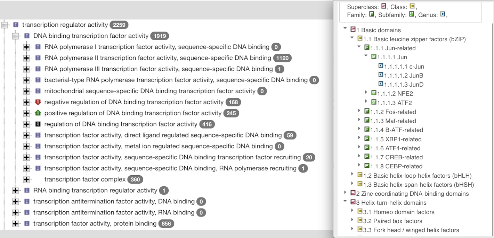

# Introduction

```{r setup,echo=FALSE}
suppressPackageStartupMessages({
library(BiocStyle)
library(TFutils)
library(org.Hs.eg.db)
library(GenomicFiles)
library(GO.db)
library(data.table)
library(knitr)
library(ggplot2)
library(data.table)
library(SummarizedExperiment)
library(BiocParallel)
library(png)
library(grid)
library(GSEABase) # for tftColl
data(fimoMap)
})
```

A central concern of genome biology is improving
understanding of gene transcription.  In simple
terms, transcription factors (TFs)
are proteins that bind to DNA, typically near gene promoter
regions.  The role of TFs in gene expression variation
is of great interest.  Progress in deciphering
genetic and epigenetic processes that affect TF abundance
and function will be essential in clarifying and
interpreting gene expression variation patterns
and their effects on phenotype.  Difficulties
of identifying functional
binding of TFs, and opportunities for using information
of TF binding in
systems biology contexts, are reviewed in @Lambert2018 and @Weirauch2014.

This paper describes an R/Bioconductor package called
TFutils, which assembles various resources intended
to clarify and unify approaches to working with
TF concepts in bioinformatic analysis.  Computations
described in this paper can be carried out with
Bioconductor version 3.7.  The package can be 
installed with
```
# use install.packages("BiocManager") if not already available
library(BiocManager) 
install("TFutils")
```

In the next section we describe the basic concepts of enumerating and
classifying TFs, enumerating their targets, and representing
genome-wide quantification of TF binding affinity.
This is followed by a review of the key data
structures and functions provided in the package, and an
example in cancer infomatics.

# Basic concepts of transcription factor bioinformatics

## Enumerating transcription factors

Given the importance of the topic, it is not surprising that
a number of bioinformatic research groups have published
catalogs of transcription factors along with metadata
about their features.  Standard nomenclature
for TFs has yet to be established.  Gene symbols,
motif sequences, and position-weight matrix catalog
entries have all been used as TF identifiers.

In TFutils we have gathered information from four
widely used resources, focusing specifically
on human TFs: Gene Ontology (GO, @Ashburner2000,
in which GO:0003700 is the tag for the molecular
function concept "DNA binding transcription factor activity"),
CISBP (@Weirauch2014), HOCOMOCO (@Kulakovskiy2018),
and the "c3 TFT (transcription factor target)" signature set of MSigDb (@Subramanian15545).
Figure \@ref(fig:lkupset) depicts
the sizes of these
catalogs, measured using counts 
of unique HGNC gene symbols.
The enumeration for GO uses Bioconductor's
`r Biocpkg("org.Hs.eg.db")` package to
find direct associations from GO:0003700
to HGNC symbols.  The enumeration for
MSigDb is heuristic
and involves parsing the gene set identifiers
used in MSigDb
for exact or close matches to HGNC symbols.
For CISBP and HOCOMOCO, the associated web
servers provide easily parsed tabular catalogs.

```{r setup2, echo=FALSE}
library(TFutils)
library(AnnotationDbi)
suppressMessages({
tfdf = select(org.Hs.eg.db::org.Hs.eg.db, 
    keys="GO:0003700", keytype="GO", 
    columns=c("ENTREZID", "SYMBOL"))
})
tfdf = tfdf[, c("ENTREZID", "SYMBOL")]
TFs_GO = TFCatalog(name="GO.0003700", nativeIds=tfdf$ENTREZID,
 HGNCmap=tfdf)

data(tftColl)
data(tftCollMap)
TFs_MSIG = TFCatalog(name="MsigDb.TFT", nativeIds=names(tftColl),
 HGNCmap=data.frame(tftCollMap,stringsAsFactors=FALSE))

data(cisbpTFcat)
TFs_CISBP = TFCatalog(name="CISBP.info", nativeIds=cisbpTFcat[,1],
 HGNCmap = cisbpTFcat)

data(hocomoco.mono)
TFs_HOCO = TFCatalog(name="hocomoco11", nativeIds=hocomoco.mono[,1],
 HGNCmap=hocomoco.mono)
```

```{r lkupset,echo=FALSE,out.width='60%', fig.cap='Sizes of TF catalogs and of intersections based on HGNC symbols for TFs.', fig.pos='h'}
suppressPackageStartupMessages({library(UpSetR)})
allhg = keys(org.Hs.eg.db::org.Hs.eg.db, keytype="SYMBOL")
#activesym = unique(unlist(list(TFs_GO@HGNCmap[,2], TFs_HOCO@HGNCmap[,2], TFs_MSIG@HGNCmap[,2], TFs_CISBP@HGNCmap[,2])))
activesym = unique(unlist(list(HGNCmap(TFs_GO)[,2], HGNCmap(TFs_HOCO)[,2], HGNCmap(TFs_MSIG)[,2], HGNCmap(TFs_CISBP)[,2])))
use = intersect(allhg, activesym)
mymat = matrix(0, nr=length(use), nc=4)
rownames(mymat) = use
iu = function(x) intersect(x,use)
mymat[na.omit(iu(HGNCmap(TFs_GO)[,2])),1] = 1
mymat[na.omit(iu(HGNCmap(TFs_MSIG)[,2])),2] = 1
mymat[na.omit(iu(HGNCmap(TFs_HOCO)[,2])),3] = 1
mymat[na.omit(iu(HGNCmap(TFs_CISBP)[,2])),4] = 1
colnames(mymat) = c("GO", "MSigDb", "HOCO", "CISBP")
upset(data.frame(mymat),nsets=4,sets=c("MSigDb", "HOCO", "GO", "CISBP"), keep.order=TRUE, order.by="degree"
)
```

## Classification of transcription factors

As noted by @Weirauch2014, interpretation of the "function and evolution
of DNA sequences" is dependent on the analysis of sequence-specific
DNA binding domains.  These domains are dynamic and cell-type
specific (@Gertz2013).  Classifying TFs according to
features of the binding domain is an ongoing process of
increasing intricacy.  Figure \@ref(fig:TFclass)
shows excerpts of hierarchies of terms related to TF type
derived from GO (on the left) and 
[TFclass](http://tfclass.bioinf.med.uni-goettingen.de/) (@Wingender2018).
There is a disagreement between our enumeration of TFs based
on GO in Figure \@ref(fig:lkupset) and the 1919 shown in AmiGO,
as the latter includes a broader collection of receptor activities.

```{r TFclass, out.width='110%', fig.cap = 'Screenshots of AmiGO and TFClass hierarchy excerpts.',echo=FALSE}

```

Table \@ref(tab:classtab) provides examples of frequently
encountered TF classifications in the CISBP and HOCOMOCO
catalogs.  The numerical components of the HOCOMOCO
classes correspond to TFClass subfamilies (@Wingender2018).

Table: (\#tab:classtab) Most frequently represented TF classes in CISBP and HOCOMOCO. Entries in columns Nc (Nh) are numbers of distinct TFs annotated to classes in columns CISBP (HOCOMOCO) respectively.  Entries are ordered top to bottom by frequency of occurrence.  There is no substantive correspondence between entries on a given row.  Harmonization of class terminology could begin by creating such a correspondence, but that is beyond the scope of this paper.

```{r dodo,echo=FALSE}
library(knitr)
cismap = HGNCmap(TFs_CISBP)
scis = split(cismap, cismap$HGNC)
uf = vapply(scis, function(x) x$Family_Name[1],"character")
CISTOP = sort(table(uf),decreasing=TRUE)[1:10]
hoc = HGNCmap(TFs_HOCO)
shoc = split(hoc, hoc$HGNC)
sfam = vapply(shoc, function(x)x$`TF family`[1], "character")
HOTOP = sort(table(sfam),decreasing=TRUE)[1:10]
kable(data.frame(CISBP=names(CISTOP), Nc=as.numeric(CISTOP), 
   HOCOMOCO=names(HOTOP), Nh=as.numeric(HOTOP)), format="markdown")
```

## Enumerating TF targets 

The Broad Institute MSigDb (@Subramanian15545) includes
a gene set collection devoted to cataloging TF targets.
We have used Bioconductor's `r Biocpkg("GSEABase")` package
to import and serialize the `gmt` representation of this
collection.

```{r lkbro}
TFutils::tftColl
```

Names of TFs for which target sets are assembled are encoded 
in a systematic way, with underscores separating substrings
describing motifs, genes, and versions.
Some peculiarity in nomenclature in the MSigDb labels can
be observed:
```{r lktft2}
grep("NFK", names(TFutils::tftColl), value=TRUE)
```

Manual curation will be needed to improve the precision
with which MSigDb TF target sets can used.

## Quantitative predictions of TF binding affinities

### Affinity scores based on reference sequence

The FIMO algorithm of the MEME suite (@Grant2011) was used
to score the human reference genome for TF binding
affinity for `r nrow(fimoMap)` motif matrices
to which genes are associated.  Full
details are provided in @Sonawane2017.  Sixteen (16)
tabix-indexed BED files are lodged in an AWS S3
bucket for illustration purposes.

```{r demoredu}
library(GenomicFiles)
data(fimo16)
fimo16
head(colData(fimo16))
```

We harvest scores in a genomic interval of interest
(bound to `fimo16` in the `rowRanges` assignment
below) using `reduceByFile`.
This yields a list with one element per file.  Each such
element holds a list of `scanTabix` results, one per query range.
```{r demoredu2, cache=TRUE}
library(BiocParallel)
register(SerialParam()) # important for macosx?
rowRanges(fimo16) = GRanges("chr17", IRanges(38.077e6, 38.084e6))
rr = GenomicFiles::reduceByFile(fimo16, MAP=function(r,f)
  scanTabix(f, param=r))
```
scanTabix produces a list of vectors of text strings, which we parse
with `data.table::fread`.  The resulting tables are then
reduced to a genomic location and -log10 of the p-value derived
from the binding affinity statistic of FIMO in the vicinity
of that location.
```{r paraa}
asdf = function(x) data.table::fread(paste0(x, collapse="\n"), header=FALSE)
gg = lapply(rr, function(x) {
       tmp = asdf(x[[1]][[1]]) 
       data.frame(loc=tmp$V2, score=-log10(tmp$V7))
     })
for (i in 1:length(gg))  gg[[i]]$tf = colData(fimo16)[i,2]
```
It turns out there are too many distinct TFs
to display individually, so we label the
scores with the names of the
associated TF families as defined in CISBP.
```{r domat}
matchcis = match(colData(fimo16)[,2], cisbpTFcat[,2])
famn = cisbpTFcat[matchcis,]$Family_Name
for (i in 1:length(gg))  gg[[i]]$tffam = famn[i]
nn = do.call(rbind, gg)
```

<!--
> odf = as.data.frame(reduce(genemodel("ORMDL3")))
'select()' returned 1:many mapping between keys and columns
> odf
  seqnames    start      end width strand
1    chr17 38077296 38078938  1643      -
2    chr17 38079365 38079516   152      -
3    chr17 38080283 38080478   196      -
4    chr17 38081008 38081058    51      -
5    chr17 38081422 38081624   203      -
6    chr17 38081876 38083094  1219      -
7    chr17 38083737 38083884   148      -
-->

A simple display of _predicted_ TF binding affinity near the
gene ORMDL3
is provided in Figure \@ref(fig:finish).

```{r finish, fig.height=3.5,echo=FALSE,fig.cap='TF binding in the vicinity of gene ORMDL3.  Points are -log10-transformed FIMO-based p-values colored according to TF class as annotated in CISBP.  Segments at bottom of plot are transcribed regions of ORMDL3 according to UCSC gene models in build hg19.'}
library(ggplot2)
myf = function(a=38077296, b=38078938) 
  geom_segment(aes(x=a, xend=b, y=2.85, yend=2.85, colour="[ORMDL3]"))
ggplot(nn, aes(x=loc,y=score,group=tffam, colour=tffam)) + geom_point() + myf() +
 myf(38079365, 38079516) + myf(38080283, 38080478) + 
 myf(38081008, 38081058) + myf(38081422, 38081624) + 
 myf(38081876, 38083094) + myf(38083737, 38083884) + ylab("-log10 FIMO p-value") + 
 xlab("position on chr17, hg19")
```

### TF binding predictions based on ChIP-seq data from ENCODE

The ENCODE project provides BED-formatted
reports on ChIP-seq experiments for many
combinations of cell type and DNA-binding
factors.  TFutils includes a table `encode690`
that gives information on 690 experiments involving
pairs formed from
`r length(table(TFutils::encode690$cell))` cell lines and 
`r length(table(TFutils::encode690$target))` TFs for which
results have been recorded as GRanges
instances that can be
acquired with the `r Biocpkg("AnnotationHub")` package.
Positional relationships between cell-type specific binding
sites and genomic features can be investigated.  An
illustration is given in Figure \@ref(fig:lkbi), in which
is it suggested that in HepG2 cells, CEBPB exhibits a distinctive
pattern of binding in the vicinity of ORMDL3.  

```{r lkbi, fig.cap='Binding of CEBPB in the vicinity of ORMDL3 derived from ChIP-seq experiments in four cell lines reported by ENCODE.  Colored rectangles at top are regions identified as narrow binding peaks, arrows in bottom half are exons in ORMDL3.  Arrows sharing a common vertical position are members of the same transcript as cataloged in Ensembl version 79.', echo=FALSE}
pp = readPNG("ormdl3CEBPB.png")
grid.raster(pp)
```


## Summary

We have compared enumerations of human transcription factors
by different projects, provided access to two forms of
binding domain classification, and illustrated the use
of cloud-resident genome-wide binding predictions.
In the next section we review selected details of data structures
and methods of the `r Biocpkg("TFutils")` package.

# Methods 

## Implementation

### The `TFCatalog` class

A number of relatively small reference
```
data(tftColl)
data(tftCollMap)
data(cisbpTFcat)

TFs_MSIG = TFCatalog(name="MsigDb.TFT", nativeIds=names(tftColl),
 HGNCmap=data.frame(tftCollMap,stringsAsFactors=FALSE))

TFs_CISBP = TFCatalog(name="CISBP.info", nativeIds=cisbpTFcat[,1],
 HGNCmap = cisbpTFcat)

TFs_MSIG

TFs_CISBP
```

## Operation

